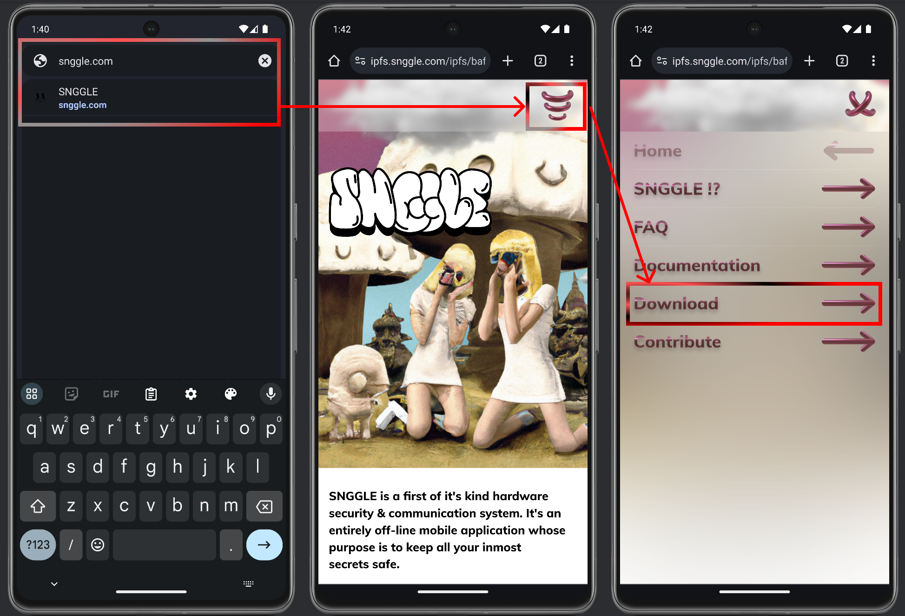
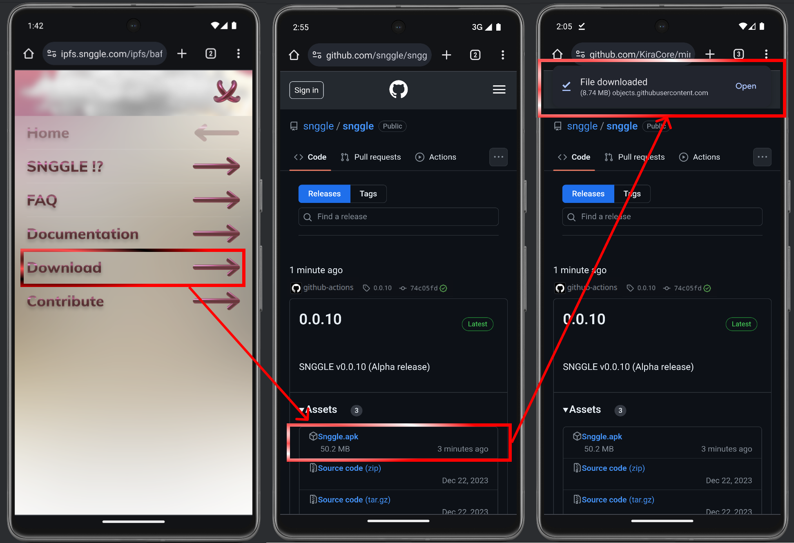
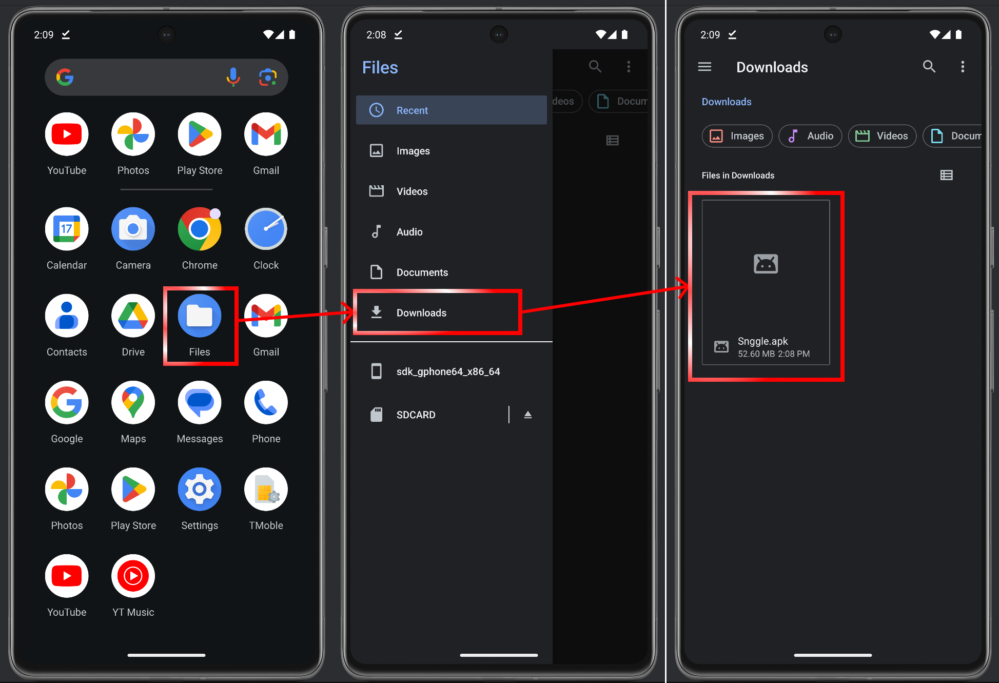
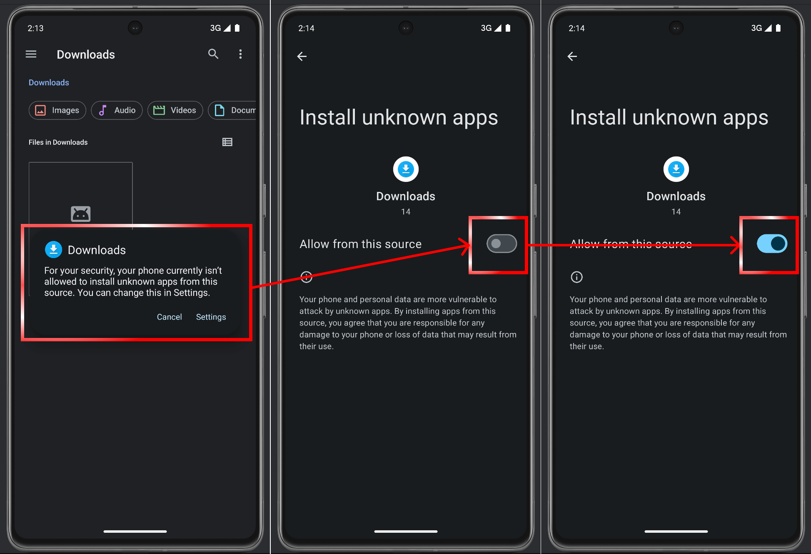
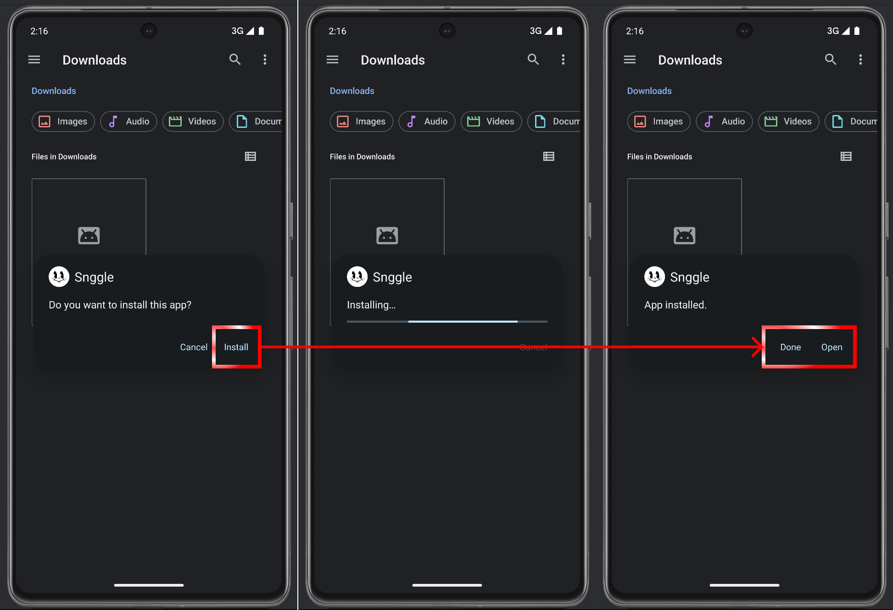
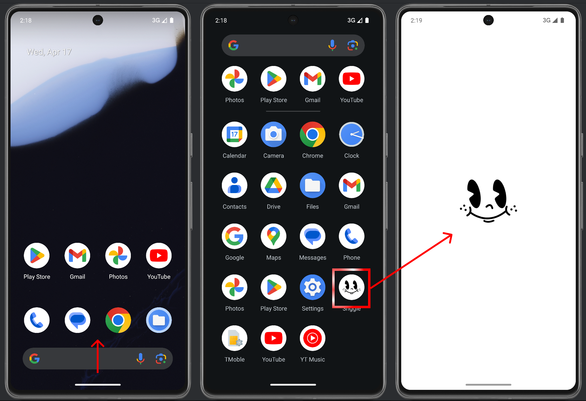

# Snggle

## Requirements:
- Android 9.0 (Pie) (API 28) or higher

## How to Install:
**Note:** _The installation process may vary slightly depending on the version of Android, the device’s system overlay, or other applications installed on your device. Please ensure that you follow any prompts specific to your device’s configuration to complete the installation successfully._

1. Navigate to the SNGGLE website ([https://snggle.com/](https://snggle.com/)) and locate the **Download** button.
2. Click on the **Download** button. You will be redirected to the GitHub page, which lists all the released versions of the SNGGLE application.
3. Identify the version you wish to install. It is recommended to download the first version listed (**Latest release**).
4. After selecting the desired version, click on the file with the .apk extension found in the **Assets** section. This will automatically initiate the download of the application.
5. Once the download is complete, locate the .apk file on your device, which is typically located in the "Download" directory and tap on it to start the installation process.
6. If this is your first time installing an application from sources other than Google Play, a security alert will prompt you to allow installation from unknown sources. Enable the permission to proceed with installing the SNGGLE application.
7. You will then be prompted to confirm the installation. Tap "Install" and wait for the installation process to complete.
8. Once installed, find the SNGGLE application in your device's app menu and open it.

 
 

